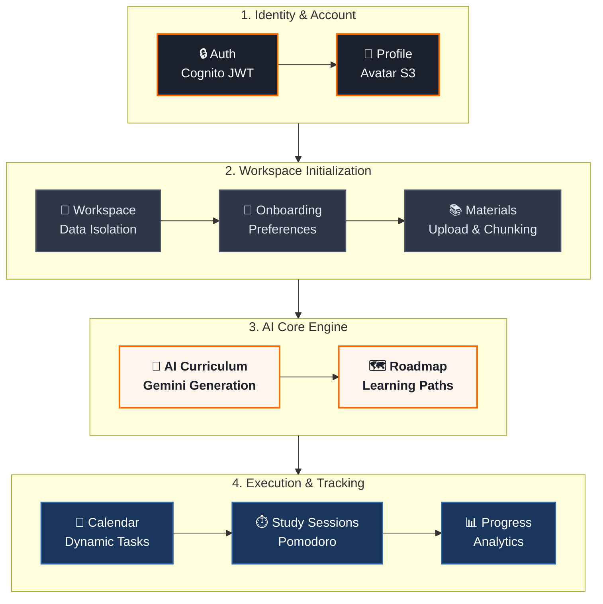

<div align="center">

# 🏃 SkillSprint Backend API

*Personalized Workspace-Based Learning Platform*

<p align="center">
  
  
  
  
  
  
</p>

> **SkillSprint** is an intelligent, workspace-based learning system that guides learners through a complete end-to-end flow. The platform leverages **AWS Cognito** for authentication, **Gemini AI** for smart curriculum generation, **AWS S3** for file storage, and **Sepay** for payment processing.

</div>

---

## 🌊 Core Learning Architecture

The system is designed to seamlessly transition users from initial onboarding to active learning and progress tracking.



---

## 🛠️ Tech Stack

| Category | Technology | Version |
| :--- | :--- | :--- |
| **Language & Framework** | Java, Spring Boot | 17+, 3.3.5 |
| **Databases** | MySQL (Dev), H2 (Test), Redis (Cache/Session)| 8.0, 7-alpine |
| **ORM & Build** | Hibernate, Spring Data JPA, Maven | — |
| **Cloud & Services** | AWS Cognito (Auth), AWS S3 (Storage) | — |
| **AI & Processing** | Google Gemini AI, Apache PDFBox, Apache POI | 2.5-flash, 3.0.3/5.3.0 |
| **Real-time & DevTools**| WebSocket, Lombok, Docker Compose | — |

---

## 🚀 Getting Started

### 📋 Prerequisites
* **Java 17+** & **Maven**
* **Docker & Docker Compose** (for local MySQL & Redis)
* **AWS Account** (Cognito User Pool & S3 bucket)
* **Gemini API Key** *(Optional - falls back to rule-based generation)*
* **Sepay Account** *(Optional - for payments)*

### 🔧 Installation

**1. Clone the repository**
```bash
git clone [https://github.com/HieuPT-04/Project_SkillSprint.git](https://github.com/HieuPT-04/Project_SkillSprint.git)
cd Project_SkillSprint
```

**2. Start Infrastructure**
```bash
# Spins up MySQL (3306) and Redis (6379)
docker compose up -d
```
> *Note: Hibernate is configured with `ddl-auto: update`, so tables are auto-created on startup.*

**3. Build & Run**
```bash
mvn spring-boot:run -Dspring-boot.run.jvmArguments="--enable-native-access=ALL-UNNAMED"
```
Verify the server is running: `curl http://localhost:8080/health`

---

## 📂 Project Structure

```text
📦 src/main/java/com/skillsprint/
┣ 📜 SkillSprintApplication.java      # 🚀 Spring Boot Entry Point
┣ 📂 common/                          # 🧩 Shared utilities & global Response Wrappers
┣ 📂 configuration/                   # ⚙️ Core system configurations
┃ ┣ 📂 ai/                            # 🧠 Gemini AI Client & Properties
┃ ┣ 📂 cognito/                       # 🔐 AWS Cognito Setup
┃ ┣ 📂 payment/                       # 💳 Sepay Webhook config
┃ ┣ 📂 s3/                            # ☁️ AWS S3 Client config
┃ ┗ 📂 security/                      # 🛡️ CORS, Filter Chains & Session Enforcement
┣ 📂 controller/                      # 🚏 REST API Controllers (Routing)
┣ 📂 dto/                             # 📦 Request & Response Data Transfer Objects
┣ 📂 entity/                          # 🗄️ 30+ JPA Entities (Database Mapping)
┣ 📂 enums/                           # 🏷️ System Constants & Enumerations
┣ 📂 exception/                       # 🚨 Global Exception Handlers (@ControllerAdvice)
┣ 📂 mapper/                          # 🔄 MapStruct-style entity-to-DTO converters
┣ 📂 repository/                      # 💾 Spring Data JPA Interfaces
┗ 📂 service/                         # 💼 Business Logic Layer
  ┣ 📂 auth/                          # Authentication orchestration
  ┣ 📂 workspace/                     # Workspace & Onboarding management
  ┣ 📂 material/                      # Document extraction (PDFBox/POI)
  ┣ 📂 learningstructure/             # AI curriculum generation
  ┣ 📂 session/                       # Pomodoro & Study trackers
  ┗ 📂 progress/                      # Dashboard aggregation logic
```

---

## 📦 Core Modules & API Reference

### 🔐 Auth & Users (`/api/auth`, `/api/me`)
* **AWS Cognito Integration**: Handles Register, Login, Forgot Password, and Logout.
* **Avatar Uploads**: Direct-to-S3 uploads via presigned URLs.
* **Session Control**: Redis-backed single-session enforcement.

### 📁 Workspaces & Materials (`/api/workspaces`)
* **Workspaces**: Isolated learning environments (supports soft-delete).
* **Materials**: Upload `PDF/DOCX/TXT` via S3. Background jobs extract and chunk text automatically.

### 🧠 AI Learning Engine
* **Learning Structure**: `POST .../learning-structure/generate` (AI or Rule-based chapters & topics).
* **Roadmap**: Generates step-by-step learning paths with resources.
* **Calendar**: `POST .../calendar/generate` creates study schedules based on roadmap and user onboarding preferences.

### ⏱️ Study & Progress
* **Sessions**: Track actual study time with built-in **Pomodoro timer** support (start/pause/resume/finish).
* **Dashboard**: `GET .../progress` aggregates overall stats without LLM calls.

### 💳 Payments & Subscriptions (`/api/payments`, `/api/subscriptions`)
* **Sepay Integration**: Bank transfer QR codes with automated webhook reconciliation.

---

## ⚙️ Configuration

<details>
<summary><b>🔐 Environment Variables (Click to expand)</b></summary>

Create a `.env` file at the root. **DO NOT commit this file.**

```env
# Application
SERVER_PORT=8080
SPRING_PROFILES_ACTIVE=dev
APP_CORS_ALLOWED_ORIGINS=http://localhost:3000,http://localhost:5173

# Database (MySQL)
DB_URL=jdbc:mysql://localhost:3306/db_skill_sprint?useSSL=false&serverTimezone=UTC
DB_USERNAME=root
DB_PASSWORD=123456

# AWS Cognito
COGNITO_REGION=ap-southeast-1
COGNITO_USER_POOL_ID=your-user-pool-id
COGNITO_CLIENT_ID=your-client-id
COGNITO_CLIENT_SECRET=your-client-secret
COGNITO_DEFAULT_GROUP=LEARNER
COGNITO_ISSUER_URI=https://cognito-idp.<region>[.amazonaws.com/](https://.amazonaws.com/)<user-pool-id>

# AWS S3
AWS_REGION=ap-southeast-1
AWS_ACCESS_KEY_ID=your-access-key
AWS_SECRET_ACCESS_KEY=your-secret-key
AWS_S3_BUCKET=your-bucket-name
AWS_S3_PUBLIC_BASE_URL=https://<bucket>.s3.<region>.amazonaws.com
AWS_S3_UPLOAD_URL_EXPIRATION_MINUTES=10

# Gemini AI 
GEMINI_ENABLED=true
GEMINI_API_KEY=your-gemini-api-key
GEMINI_MODEL=gemini-2.5-flash
GEMINI_BASE_URL=[https://generativelanguage.googleapis.com](https://generativelanguage.googleapis.com)
GEMINI_MAX_INPUT_CHARS=18000

# Redis
REDIS_HOST=localhost
REDIS_PORT=6379

# Sepay
SEPAY_ENABLED=true
SEPAY_BANK_CODE=MSB
SEPAY_BANK_ACCOUNT_NUMBER=your-account-number
SEPAY_BANK_ACCOUNT_NAME=ACCOUNT HOLDER NAME
SEPAY_WEBHOOK_API_KEY=your-webhook-secret
SEPAY_QR_BASE_URL=[https://qr.sepay.vn/img?bank=](https://qr.sepay.vn/img?bank=){bankCode}&acc={accountNumber}&amount={amount}&des={content}&template=compact
SEPAY_EXPIRE_MINUTES=15
```
</details>


---

## 📝 API Response Standard

All endpoints follow a strict, predictable response wrapper.

**✅ Success**
```json
{
  "success": true,
  "code": 200,
  "message": "Thành công",
  "data": { ... }
}
```

**❌ Error**
```json
{
  "success": false,
  "code": 403,
  "message": "Bạn không có quyền thực hiện thao tác này",
  "path": "/api/admin/users"
}
```

---

## ⚠️ Notes & Known Limitations

* 🔄 **AI Fallback:** If the Gemini API fails or is disabled, the system gracefully falls back to a deterministic rule-based generator.
* 🗑️ **Soft Deletes:** Workspaces use soft-deletion (`status = DELETED`) to preserve relational integrity.
* 🔗 **Dynamic URLs:** S3 object URLs are constructed at response time; only object keys are stored in DB.
* 🚧 **Pending:** `DELETE /api/workspaces/{workspaceId}/materials/{materialId}` is currently unmapped.

---

<div align="center">
  <p><i>Developed with 🔥 by <b>Bộ Tộc Deadline</b> | Part of the EXE201 capstone course.</i></p>
</div>
