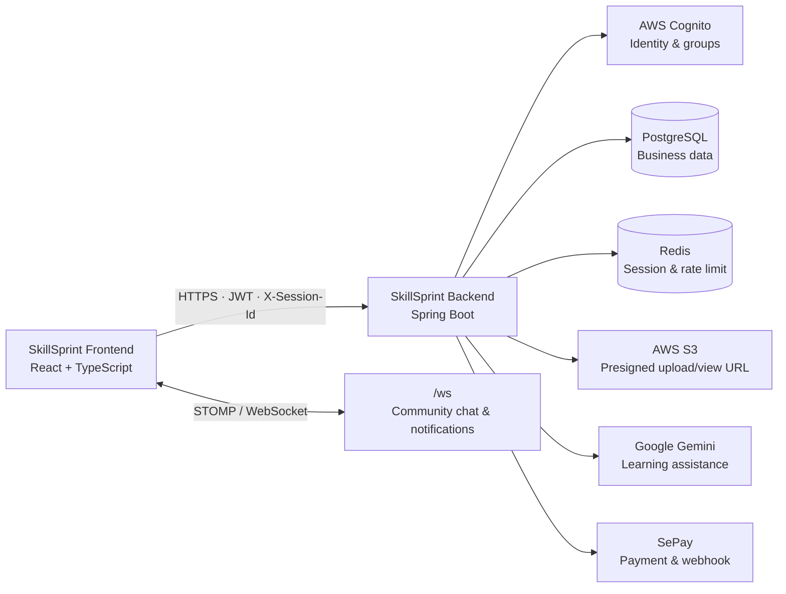

<div align="center">
  <h1>SkillSprint Backend</h1>
  <p><strong>API và lõi nghiệp vụ cho nền tảng học tập cá nhân hoá có trợ lý AI.</strong></p>
  <p>
    <a href="https://github.com/HieuPT-04/Project_SkillSprint">Backend</a> ·
    <a href="https://github.com/AnhKhoaa157/SkillSprint-FE">Frontend</a> ·
    <a href="BE_API_DOC.md">API documentation</a>
  </p>
</div>

---

## Mục lục

- [Giới thiệu](#giới-thiệu)
- [Repositories liên quan](#repositories-liên-quan)
- [Tính năng nổi bật](#tính-năng-nổi-bật)
- [Công nghệ sử dụng](#công-nghệ-sử-dụng)
- [Kiến trúc tổng quan](#kiến-trúc-tổng-quan)
- [Bắt đầu nhanh](#bắt-đầu-nhanh)
- [Biến môi trường](#biến-môi-trường)
- [Lệnh thường dùng](#lệnh-thường-dùng)
- [Cấu trúc mã nguồn](#cấu-trúc-mã-nguồn)
- [API, bảo mật và thời gian thực](#api-bảo-mật-và-thời-gian-thực)
- [Luồng kỹ thuật quan trọng](#luồng-kỹ-thuật-quan-trọng)
- [Kiểm thử và chất lượng](#kiểm-thử-và-chất-lượng)
- [Đóng góp](#đóng-góp)
- [Khắc phục sự cố](#khắc-phục-sự-cố)

## Giới thiệu

**SkillSprint Backend** là modular monolith viết bằng Spring Boot, cung cấp API, nghiệp vụ và tích hợp hạ tầng cho nền tảng học tập SkillSprint. Hệ thống dẫn dắt người học từ mục tiêu và tài liệu thô đến cấu trúc kiến thức, roadmap, lịch học, phiên học, quiz, AI Tutor và dữ liệu tiến độ.

Backend chịu trách nhiệm xác thực Cognito, phân quyền, quản lý phiên trên Redis, dữ liệu PostgreSQL, tải tệp trực tiếp qua AWS S3, tác vụ AI Gemini, thanh toán SePay, cộng đồng thời gian thực và các công cụ vận hành cho admin.

```text
Mục tiêu → Workspace → Tài liệu → Cấu trúc học tập → Roadmap → Lịch học
        → Phiên học → Quiz / AI Tutor → Tiến độ, điểm và bảng xếp hạng
```

## Repositories liên quan

| Repository | Vai trò | Liên kết |
| --- | --- | --- |
| SkillSprint Backend | API, nghiệp vụ, dữ liệu, xác thực và các dịch vụ tích hợp. | [HieuPT-04/Project_SkillSprint](https://github.com/HieuPT-04/Project_SkillSprint) |
| SkillSprint Frontend | Ứng dụng React SPA cho người học, creator và quản trị viên. | [AnhKhoaa157/SkillSprint-FE](https://github.com/AnhKhoaa157/SkillSprint-FE) |

Khi thay đổi API, cần cập nhật frontend cùng lúc và kiểm tra đúng request/response DTO. Backend được cấu hình để bỏ qua các trường JSON không khớp, nên một sai lệch tên trường có thể bị bỏ qua mà không tạo lỗi rõ ràng.

## Tính năng nổi bật

### Học tập có AI hỗ trợ

- Workspace, onboarding profile và mục tiêu học tập cá nhân.
- Upload tài liệu, theo dõi processing job, trích xuất/chunk nội dung.
- Sinh, rà soát và xác nhận learning structure trước khi tạo roadmap.
- Sinh roadmap, tài nguyên học, lịch học, task và ma trận Eisenhower.
- Study session, Pomodoro, quiz chấm điểm và AI Tutor theo ngữ cảnh.
- Dashboard tiến độ, điểm thưởng, leaderboard và reminder/notification.

### Tài khoản, gói dịch vụ và thanh toán

- Đăng ký, xác thực email, đăng nhập, làm mới phiên và luồng đổi mật khẩu qua AWS Cognito.
- JWT Resource Server, phân quyền theo Cognito group và phiên đơn trên Redis.
- Gói dịch vụ, quota tính năng, subscription và thanh toán SePay.
- Payment webhook, lịch sử thanh toán, đối soát và tác vụ hết hạn định kỳ.

### Cộng đồng, marketplace và quản trị

- Community feed: bài viết, bình luận, tương tác, báo cáo và blacklist.
- Community rooms: thành viên, lời mời, role, mute, ghim nội dung và chat STOMP thời gian thực.
- Marketplace: catalog, creator flow, review, purchase, thư viện quiz pack, challenge và ví.
- Admin dashboard: người dùng, điểm, gói dịch vụ, thanh toán, marketplace, feedback, moderation, thông báo và maintenance mode.

## Công nghệ sử dụng

| Nhóm | Công nghệ |
| --- | --- |
| Runtime | Java 17, Spring Boot 3.3.5, Maven |
| API & validation | Spring Web, Spring Validation, Jakarta Bean Validation |
| Dữ liệu | PostgreSQL 16, Spring Data JPA/Hibernate, Flyway |
| Cache & session | Redis 7 |
| Bảo mật | Spring Security, OAuth2 Resource Server, AWS Cognito JWT |
| Lưu trữ | AWS SDK v2, Amazon S3 presigned URL |
| AI | Google Gemini; fallback rule-based ở các luồng hỗ trợ |
| Thanh toán | SePay |
| Tài liệu | Apache PDFBox, Apache POI |
| Realtime | Spring WebSocket, STOMP, SockJS |
| Kiểm thử | Spring Boot Test, Spring Security Test, H2, JaCoCo |
| Container | Docker, Docker Compose |

## Kiến trúc tổng quan



Mã nguồn tuân theo layered architecture:

```text
Controller  →  Service  →  Repository  →  Entity
     │             │
     └── Request / Response DTO + Mapper
```

- Controller chỉ validate request, gọi service và trả response DTO.
- Service chứa nghiệp vụ; repository không được gọi trực tiếp từ controller.
- Entity không xuất hiện ở API boundary.
- Lỗi nghiệp vụ đi qua `AppException`, `ErrorCode` và global exception handler.
- Hệ thống chạy theo múi giờ mặc định `Asia/Ho_Chi_Minh`.

## Bắt đầu nhanh

### Yêu cầu

- JDK 17.
- Maven 3.9+.
- Docker Desktop hoặc Docker Engine kèm Docker Compose.
- Tài khoản/cấu hình AWS Cognito và S3 khi kiểm tra auth hoặc upload.
- Gemini và SePay chỉ cần cho các luồng AI/thanh toán tương ứng.

### Cài đặt

```bash
git clone https://github.com/HieuPT-04/Project_SkillSprint.git
cd Project_SkillSprint
```

### Chạy hạ tầng local

Docker Compose cung cấp PostgreSQL và Redis. PostgreSQL được map ra host port **5434**, Redis dùng port **6379**.

```bash
docker compose up -d postgres redis
```

### Tạo file `.env`

Spring Boot tự đọc file `.env` ở thư mục gốc nếu có. File này không được commit. Dưới đây là cấu hình local tối thiểu để kết nối hạ tầng Docker:

```dotenv
SPRING_PROFILES_ACTIVE=dev
DB_URL=jdbc:postgresql://localhost:5434/skillsprint
DB_USERNAME=postgres
DB_PASSWORD=123456
REDIS_HOST=localhost
REDIS_PORT=6379
APP_CORS_ALLOWED_ORIGINS=http://localhost:5173
```

Để kích hoạt đầy đủ các luồng xác thực, upload, AI và thanh toán, bổ sung thông tin từ hệ thống quản lý secret của dự án:

| Nhóm | Biến chính |
| --- | --- |
| Cognito | `COGNITO_REGION`, `COGNITO_USER_POOL_ID`, `COGNITO_CLIENT_ID`, `COGNITO_CLIENT_SECRET`, `COGNITO_ISSUER_URI` |
| AWS S3 | `AWS_REGION`, `AWS_ACCESS_KEY_ID`, `AWS_SECRET_ACCESS_KEY`, `AWS_S3_BUCKET`, `AWS_S3_PUBLIC_BASE_URL` |
| Gemini | `GEMINI_ENABLED`, `GEMINI_API_KEY`, `GEMINI_MODEL`, `GEMINI_BASE_URL` |
| SePay | `SEPAY_ENABLED`, `SEPAY_BANK_CODE`, `SEPAY_BANK_ACCOUNT_NUMBER`, `SEPAY_BANK_ACCOUNT_NAME`, `SEPAY_WEBHOOK_API_KEY` |
| Vận hành | `APP_SESSION_ENABLED`, `APP_RATE_LIMIT_ENABLED`, `FLYWAY_BASELINE_ON_MIGRATE` |

> Không đưa access key, secret, password database, token hoặc webhook key vào README, source code, issue hay pull request. Mọi biến `AWS_*`, `COGNITO_*`, `GEMINI_API_KEY` và `SEPAY_*` phải được cấp qua secret manager hoặc `.env` local.

### Khởi động ứng dụng

```bash
mvn spring-boot:run
```

Mặc định API chạy tại `http://localhost:8080`. Kiểm tra dịch vụ:

```bash
curl http://localhost:8080/health
```

Hoặc chạy toàn bộ stack trong container:

```bash
docker compose up -d --build
```

Trong chế độ container, backend kết nối PostgreSQL và Redis qua hostname nội bộ `postgres` và `redis` do Docker Compose thiết lập.

## Biến môi trường

| Biến | Mặc định / ví dụ | Mục đích |
| --- | --- | --- |
| `SERVER_PORT` | `8080` | Cổng HTTP của Spring Boot. |
| `SPRING_PROFILES_ACTIVE` | `dev` | Profile Spring được kích hoạt. |
| `DB_URL` | `jdbc:postgresql://localhost:5434/skillsprint` | JDBC URL của PostgreSQL cho local Docker. |
| `DB_USERNAME`, `DB_PASSWORD` | `postgres`, `123456` cho local Docker | Thông tin kết nối database local. |
| `REDIS_HOST`, `REDIS_PORT` | `localhost`, `6379` | Redis cho session và rate limit. |
| `APP_CORS_ALLOWED_ORIGINS` | `http://localhost:5173` | Các origin frontend được cho phép. |
| `AWS_S3_UPLOAD_URL_EXPIRATION_MINUTES` | `10` | Thời hạn presigned URL upload. |
| `GEMINI_ENABLED` | `true` | Bật/tắt Gemini integration. |
| `SEPAY_ENABLED` | `true` | Bật/tắt luồng thanh toán SePay. |

`application-dev.yml` và `application-prod.yml` đều đặt Hibernate ở `ddl-auto: validate`; schema phải được thay đổi thông qua migration Flyway, không dựa vào Hibernate tự tạo bảng.

## Lệnh thường dùng

| Lệnh | Mục đích |
| --- | --- |
| `mvn spring-boot:run` | Khởi động backend ở môi trường hiện tại. |
| `mvn test` | Chạy test và kiểm tra ngưỡng coverage JaCoCo. |
| `mvn package` | Biên dịch, kiểm thử và tạo JAR. |
| `mvn -DskipTests package` | Tạo JAR nhanh khi không cần chạy test. |
| `docker compose up -d postgres redis` | Chạy PostgreSQL và Redis local. |
| `docker compose up -d --build` | Build và chạy toàn bộ stack Docker. |
| `docker compose down` | Dừng các container của stack. |

## Cấu trúc mã nguồn

```text
Project_SkillSprint/
├── src/
│   ├── main/
│   │   ├── java/com/skillsprint/
│   │   │   ├── common/           # ApiResponse và thành phần dùng chung
│   │   │   ├── configuration/    # Security, Cognito, S3, AI, WebSocket, payment
│   │   │   ├── controller/       # REST và STOMP endpoints theo domain
│   │   │   ├── dto/              # Request/response DTO
│   │   │   ├── entity/           # JPA entities và PostgreSQL mapping
│   │   │   ├── enums/            # Enum nghiệp vụ
│   │   │   ├── exception/        # ErrorCode, AppException, global advice
│   │   │   ├── mapper/           # Entity ↔ DTO mapper
│   │   │   ├── repository/       # Spring Data JPA repositories
│   │   │   └── service/          # Nghiệp vụ theo domain
│   │   └── resources/
│   │       ├── application.yml        # Cấu hình nền tảng
│   │       ├── application-dev.yml    # Local development profile
│   │       ├── application-prod.yml   # Production profile
│   │       └── db/migration/          # Flyway migrations
│   └── test/java/com/skillsprint/     # Unit, flow và integration tests
├── docker-compose.yml                 # Backend + PostgreSQL + Redis
├── Dockerfile                         # Multi-stage Maven/JRE image
├── BE_API_DOC.md                      # Request/response API reference
├── MVP.md                             # Product scope và core flow
└── pom.xml                            # Maven dependencies và quality gates
```

## API, bảo mật và thời gian thực

### Response chuẩn

Tất cả endpoint dùng envelope thống nhất:

```json
{
  "success": true,
  "code": 200,
  "message": "Thành công",
  "data": {}
}
```

Khi validation thất bại, response có thêm `path` và danh sách `errors`. Xem toàn bộ contract, payload và response tại [BE_API_DOC.md](BE_API_DOC.md).

### Nhóm endpoint

| Nhóm | Base path / endpoint tiêu biểu |
| --- | --- |
| Health & public system | `GET /health`, `/api/system/status`, `/api/public/announcements/active` |
| Authentication | `/api/auth/**` |
| Workspace & learning | `/api/workspaces/**`, `/api/roadmap/**`, `/api/calendar/**`, `/api/study-sessions/**` |
| Cộng đồng | `/api/community/**`, WebSocket `/ws` |
| Marketplace | `/api/marketplace/**` |
| Billing & subscription | `/api/payments/**`, `/api/subscriptions/**` |
| Administration | `/api/admin/**` |

### Xác thực, phân quyền và vận hành

- API protected yêu cầu Bearer JWT từ AWS Cognito; Cognito group được map sang Spring role.
- Session đơn được kiểm tra qua header `X-Session-Id` và Redis.
- Các public endpoint gồm health, luồng auth, trạng thái hệ thống, public announcement, danh sách plan, SePay webhook và WebSocket handshake.
- Rate limit bảo vệ các luồng nhạy cảm: đăng nhập, đăng ký, reset mật khẩu, tạo payment và community chat.
- Maintenance filter chặn hoạt động của người dùng khi hệ thống bảo trì, trong khi admin vẫn có thể vận hành.

### WebSocket/STOMP

- Endpoint: `/ws`, hỗ trợ cả WebSocket thuần và SockJS.
- Broker destinations: `/topic`, `/queue`; app prefix: `/app`; user prefix: `/user`.
- Client gửi Bearer token trong STOMP `CONNECT`; subscription vào phòng community được kiểm tra quyền thành viên trên server.

## Luồng kỹ thuật quan trọng

### Upload trực tiếp lên S3

Không có endpoint `multipart/form-data`. Client upload trực tiếp lên S3 bằng presigned URL:

```text
1. Client ── POST …/upload-url { fileName, contentType } ──► Backend
2. Backend kiểm tra loại tệp, tạo objectKey theo user và ký URL PUT
3. Client ── PUT raw bytes (đúng Content-Type, không Authorization) ──► S3
4. Client ── gửi objectKey xác nhận upload ──► Backend
5. Backend kiểm tra prefix sở hữu + headObject rồi mới lưu metadata
```

- Database chỉ lưu `objectKey`, không lưu presigned URL hoặc URL công khai.
- URL xem tệp là presigned GET URL có thời hạn và được tạo khi cần.
- Request DTO phải khớp chính xác: Jackson có thể bỏ qua trường lạ thay vì trả lỗi.

### Tạo nội dung học và AI fallback

Tài liệu được xử lý theo chuỗi: upload → processing job → extract/clean/chunk → learning structure → user review/confirm → roadmap → calendar task → study session. Gemini hỗ trợ các luồng learning structure, calendar, quiz và tutor; các luồng phù hợp có fallback rule-based khi AI không khả dụng.

### Tác vụ nền

Scheduling được bật toàn ứng dụng và xử lý các công việc như processing material, dispatch reminder, đánh dấu task quá hạn, hết hạn subscription và payment.

## Kiểm thử và chất lượng

Repository có test unit/service, controller test và API flow test cho các domain chính. H2 được dùng trong test; PostgreSQL là database cho dev/prod.

`mvn test` chạy JaCoCo cùng test suite. Build chỉ đạt khi bundle đạt tối thiểu:

| Chỉ số | Ngưỡng tối thiểu |
| --- | --- |
| Instruction coverage | 40% |
| Branch coverage | 20% |

Trước khi mở pull request, chạy:

```bash
mvn test
mvn package
```

Khi thay đổi database, luôn thêm migration Flyway. Khi thay đổi controller, bổ sung hoặc cập nhật test cho request, response, phân quyền và tình huống lỗi liên quan.

## Đóng góp

1. Tạo branch từ `main` đã cập nhật.
2. Giữ thay đổi nhỏ, theo đúng domain và không trộn refactor không liên quan.
3. Dùng PostgreSQL syntax; UUID cho identity; enum lưu dạng string; dữ liệu JSON dùng `jsonb`.
4. Giữ tách biệt request DTO, response DTO và entity; controller phải mỏng.
5. Dùng `AppException(ErrorCode.…)` cho lỗi nghiệp vụ, không tự tạo response lỗi rời rạc.
6. Chạy `mvn test` và `mvn package`, rồi mô tả rõ các API/migration thay đổi trong pull request.

## Khắc phục sự cố

| Vấn đề | Cách kiểm tra / xử lý |
| --- | --- |
| Backend không kết nối PostgreSQL local | Docker Compose map PostgreSQL ra host port `5434`; đặt `DB_URL=jdbc:postgresql://localhost:5434/skillsprint`. |
| `mvn spring-boot:run` thiếu DB credential | Tạo `.env` và đặt tối thiểu `DB_USERNAME`, `DB_PASSWORD`; kiểm tra container Postgres đang healthy. |
| Frontend bị CORS | Thêm đúng origin frontend vào `APP_CORS_ALLOWED_ORIGINS`, ví dụ `http://localhost:5173`. |
| JWT bị từ chối | Kiểm tra Cognito issuer, user pool, client configuration và Bearer token. |
| Session bị từ chối sau đăng nhập | Kiểm tra Redis, `X-Session-Id` và `APP_SESSION_ENABLED`. |
| Upload S3 lỗi | Đảm bảo raw PUT dùng đúng `Content-Type`, không có auth header và `objectKey` được xác nhận sau upload. |
| Flyway validate thất bại | Không sửa schema thủ công; thêm/cập nhật migration tương ứng rồi chạy lại. |
| WebSocket không kết nối | Kiểm tra `/ws`, CORS origin, STOMP `Authorization` header và quyền thành viên của community room. |

---

<div align="center">
  Xây dựng nền tảng đáng tin cậy cho hành trình học tập có mục tiêu, có phản hồi và có tiến bộ. 🚀
</div>
